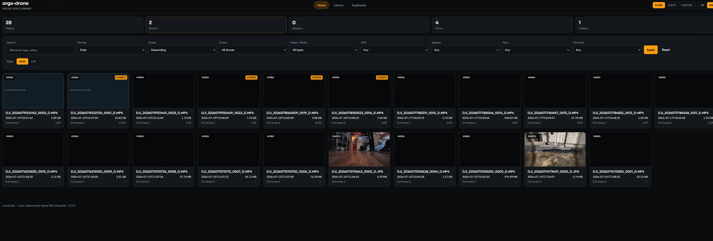
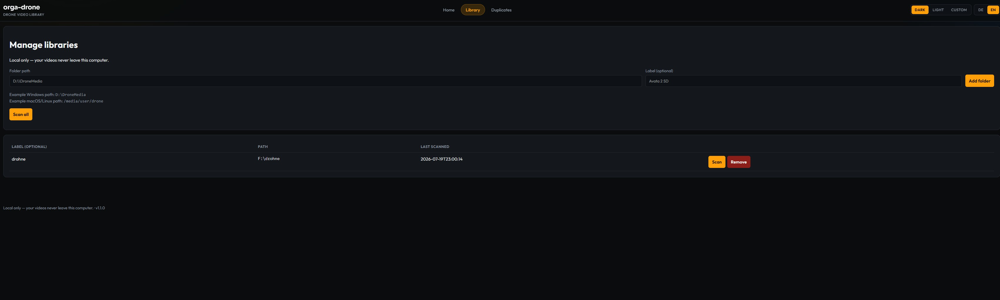
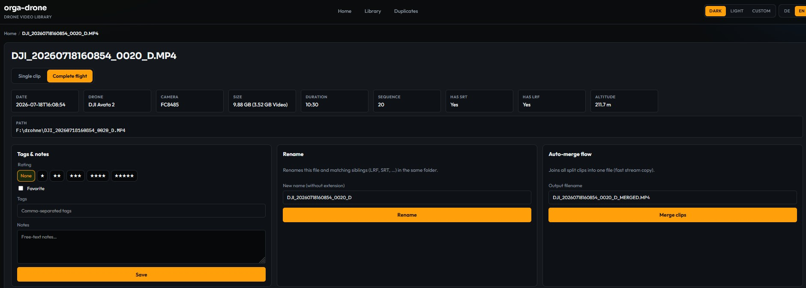
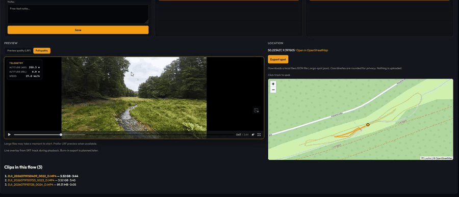

# orga-drone

Local open-source **drone video library** manager. Built first for **DJI Avata 2**, works on Windows (primary), macOS, and Linux.

Your media stays on your machine. No cloud account is required for the MVP.

**Windows:** [Download latest exe (zip)](https://github.com/Magehawks/orga-drone/releases/latest/download/orga-drone-windows-x64.zip) · [All releases](https://github.com/Magehawks/orga-drone/releases)

## Features (MVP)

- Index one or more folders / drives into a single library
- List videos and photos by **date**, **size**, **duration**, **drone**, **GPS**, **flow**
- Index **vacation / hobby photos & videos** brand-agnostically (phones, cameras, action cams — no `DJI_` filename required)
- Detect **drone model** from DJI MP4 metadata / photo EXIF (`FC8485` → DJI Avata 2); other cameras use label **Camera**
- Read **GPS** from DJI `.SRT` telemetry, photo EXIF (JPEG/HEIC/…), and best-effort video container tags (ISO 6709 / ffprobe when available)
- Group **split clips** (≈4 GB FAT32 splits) into a **flow**
- Group a logical **flight session** (takeoff → landing) across one or more clips/flows
- Show location on an embedded **OpenStreetMap** map (Leaflet) + external OSM link
- UI in **German** and **English** (JSON + `.po` i18n files for future languages)
- **Themes**: Dark, Light, and Custom (accent / background / panel) — choice persisted via cookie + `%APPDATA%/orga-drone/theme.json`
- **Rename** files (and matching LRF/SRT siblings) from the detail page
- **Auto-merge** split flow clips into one MP4 (via bundled/`imageio-ffmpeg` or system `ffmpeg`; originals kept)
- **Spot export** (GeoJSON / `.orga-spot.json`) from the detail page when GPS is available — **local download only**, no upload
- Detect **likely duplicates** across library folders (SD + backup) via DJI stem / size+date+duration heuristics — no auto-delete
- **Live SRT telemetry overlay** on the detail player (altitude + ground speed) synced to playback when a track exists
- **Browse date range** — filter by `date_from` / `date_to` on recorded date (Browse page + URL params)
- **Ask the library** — natural-language search (DE/EN rule parser), e.g. `videos from Malta vacation`, `photos November 2025`; programmatic access via `POST /api/search` (JSON)
- **Auto-tags on scan** — year/month from `recorded_at` (`2025`, `2025-11`) and offline place names from GPS (`reverse-geocoder`, SQLite cache); stored in `auto_tags_json` / `place_json`, separate from manual user tags

## Screenshots

Home / overview (German UI):



Library folders:



Clip detail with map and telemetry:



Realtime map marker follows video playback / Kartenmarker folgt der Videowiedergabe:



## Requirements

- Python **3.11+**
- `reverse-geocoder` (via `requirements.txt`) for offline place auto-tags when GPS is present
- Optional: network access for OSM map tiles (library itself works offline)

## Install (Python application)

```bash
git clone https://github.com/YOUR_USER/orga-drone.git
cd orga-drone
python -m venv .venv

# Windows
.venv\Scripts\activate

# macOS / Linux
source .venv/bin/activate

pip install -r requirements.txt
pip install -e .
```

Copy environment defaults if you want:

```bash
cp .env.example .env
```

Do **not** put passwords or API keys in the repo. The app does not need them for local use.

## Run

```bash
python -m orga_drone
```

Or:

```bash
orga-drone
```

By default this opens a **native desktop window** (pywebview / Edge WebView2 on Windows) — no Chrome/Edge browser chrome. The FastAPI UI runs locally on `127.0.0.1` (port `8765`, or another free port if busy).

Fallback / power-user options:

| Goal | How |
|------|-----|
| Old behavior (system browser) | Set `ORGA_DRONE_BROWSER=1` |
| pywebview not installed | Opens the system browser automatically |
| Open manually | Visit `http://127.0.0.1:8765/` |

### Windows exe (end users)

**[Download latest Windows build](https://github.com/Magehawks/orga-drone/releases/latest/download/orga-drone-windows-x64.zip)** (`orga-drone-windows-x64.zip`)

1. Download the zip (or pick a version from [Releases](https://github.com/Magehawks/orga-drone/releases))
2. Unzip
3. **Double-click `orga-drone.exe`** — a desktop window opens; add a library folder when prompted

See [`packaging/README.md`](packaging/README.md) for build notes. A rebuild is required for existing release zips to pick up the desktop shell.

### Add your media

1. Open **Library**
2. Paste a folder path (example only — use your own path):
   - Windows: `D:\DroneMedia`
   - macOS/Linux: `/media/user/drone`
3. Click **Add folder** (scans immediately)
4. Browse, filter by date range, **Ask the library**, and open details / map

### Browse & search

On **Browse**, use **From** / **To** (`date_from`, `date_to`) to narrow by recorded date. **Ask the library** accepts short DE/EN phrases (kind, month/year, place keywords, favorites) — parsed server-side and combined with explicit filters.

Examples: `videos from Malta`, `photos November 2025`, `favoriten 2024`.

JSON API (same filter logic):

```bash
curl -s -X POST http://127.0.0.1:8765/api/search \
  -H "Content-Type: application/json" \
  -d '{"ask": "photos November 2025"}'
```

Body fields: `ask` (or `query`), plus optional `kind`, `date_from`, `date_to`, `q`, `place`, `tags`, `favorite`, `limit`. Explicit fields override parsed NL fields when both are set.

### Tags

Each library scan computes **auto tags** from metadata: calendar year and month from `recorded_at`, plus city/region/country from GPS when available (offline reverse geocoding, cached in SQLite). Auto tags are read-only on the detail page. **User tags** on the detail form stay fully manual and editable (`tags_json` per library path).

Disable GPS place lookup (time tags still apply): `ORGA_DRONE_GEOCODE=off` in `.env` (default: `offline`).

**Auto-Tags beim Scan:** Jahr/Monat aus Aufnahmedatum; Ortsnamen offline aus GPS (Standard). Nutzer-Tags bleiben manuell auf der Detailseite.

**Urlaubs- und Hobby-Medien (markenunabhängig):** Neben DJI-Dateien indexiert orga-drone normale Fotos und Videos von Smartphones und Kameras (iPhone, Android, Canon, Sony, Nikon, GoPro, …) — **ohne** `DJI_`-Dateinamenpflicht. Unter **Medien** filtert **Quelle** nach Drohne vs. andere Geräte.

| Typ | Formate | Datum | GPS / Karte |
|-----|---------|-------|-------------|
| Fotos | JPG/JPEG, PNG, WebP, HEIC/HEIF (`pillow-heif`), DNG | EXIF `DateTimeOriginal` → sonst mtime | EXIF-GPS wenn vorhanden → OSM-Detailkarte / Weltkarte |
| Videos | MP4, MOV, M4V, MKV | Container-`creation_time` / ffprobe → sonst mtime | Best-effort (ISO 6709 / ffprobe); **viele Handy-Videos haben kein GPS** und erscheinen trotzdem in der Bibliothek |

**iPhone Live Photos:** Export oft als Standbild (`.HEIC`/`.JPG`) plus kurzes Begleit-`.MOV` mit gleichem Basisnamen. orga-drone erkennt solche Paare beim Scan, indexiert das **Bild als Foto** und blendet das Live-MOV als Sidecar aus (kein eigenständiges Video in Medien/Weltkarte). Ein alleinstehendes `.MOV` ohne passendes Bild bleibt ein normales Video.

Nicht-DJI-Medien bekommen typischerweise das Label **Camera** und `source_type` phone/camera/unknown; DJI-Erkennung (SRT, Flows, Sessions) bleibt unverändert.

**Weltkarte (`/map`):** Leaflet + MarkerCluster liegen unter `/static/vendor/` (kein CDN nötig). OSM-Kartentiles brauchen weiterhin Netz.

App data (SQLite index) is stored in the OS app-data folder, e.g.:

- Windows: `%APPDATA%\orga-drone\`
- macOS: `~/Library/Application Support/orga-drone/`
- Linux: `~/.local/share/orga-drone/`

Override with `ORGA_DRONE_DATA_DIR` in `.env`.

`ORGA_DRONE_GEOCODE` — `offline` (default, bundled reverse geocoder) or `off` to skip place lookup during scan.

### Themes

In the header, switch **Dark** / **Light** / **Custom**. Custom shows color pickers for accent, background, and panel; click **Apply** to save. Preference is stored in a cookie and mirrored to `theme.json` in the app-data folder (not in the git repo).

### Spot export (GeoJSON)

On a detail page with GPS, use **Export spot** / **Spot exportieren**. The browser downloads a `.orga-spot.json` GeoJSON file (also available at `GET /media/{id}/export/spot.geojson`).

- **Local only** — nothing is uploaded; files stay on your machine.
- Coordinates are rounded to **4 decimal places** (≈11 m) so the exact home/takeoff point is not exported.
- Optional flight track is included as a simplified LineString when SRT telemetry exists.
- Future **community sharing** of flight spots will be opt-in and separate from this local export.

### Duplicates (SD + backup)

Open **Duplicates** / **Duplikate** in the nav (or visit `/duplicates`). Click **Scan duplicates** after indexing two or more folders that may contain the same clips.

Matching (MVP, no full-file hash):

| Signal | Rule |
|--------|------|
| DJI stem | Same normalized `DJI_YYYYMMDDHHMMSS_NNNN_M` stem (case-insensitive) |
| Attributes | Same filename + **exact** size, `recorded_at` within **±2 s**, `duration_s` within **±1 s** |

Groups of 2+ copies show path, library folder, size, and date, with a link to each detail page. **Keep hint:** prefer the backup-drive copy. orga-drone **never deletes** files automatically — detection and navigation only. Results always reflect the current library index (re-scan folders, then scan duplicates again).

## Distribution

| Channel | Audience | Status |
|---------|----------|--------|
| **Python app** (this repo) | Developers / power users | Available now |
| **Prebuilt downloads** (GitHub Releases, Windows zip via PyInstaller) | End users without Python | Available — see [Releases](https://github.com/Magehawks/orga-drone/releases) and [`packaging/README.md`](packaging/README.md) |

Prebuilt binaries ship **only the application**, never your videos or database.

## DJI notes

Typical Avata 2 filenames:

```text
DJI_YYYYMMDDHHMMSS_NNNN_D.MP4
DJI_YYYYMMDDHHMMSS_NNNN_D.LRF   # proxy
DJI_YYYYMMDDHHMMSS_NNNN_D.SRT   # telemetry (GPS, altitude, …)
DJI_YYYYMMDDHHMMSS_NNNN_D.JPG
```

Long recordings are often split near ~3.5 GB. orga-drone groups those consecutive parts into one **flow**.

### Sessions vs Flows

| | **Flow** | **Session** |
|---|----------|-------------|
| Meaning | One continuous recording split by the camera/filesystem (FAT32 ≈4 GB parts) | One logical flight from takeoff to landing |
| Typical size | 2+ consecutive near-full files with tiny gaps | One or more clips/flows with short idle gaps |
| Detection | File size near limit + sequence/time | Time gaps + optional SRT altitude/GPS (near ground = landing) |
| UI | Badge “N parts”; filter “Only multi-clip flows” | Badge “N clips”; filter “Only multi-clip sessions”; detail lists all session clips |

Flows nest inside sessions: split parts of the same recording always share one session. After each library scan, flows are rebuilt first, then sessions.

### Telemetry overlay (SRT)

On a video detail page with a scanned SRT track, a small **Telemetry** panel appears on the preview during playback. Absolute/relative altitude come from the current track sample; ground speed is estimated from consecutive GPS points and cue times (or evenly along the clip when `t` is missing). Values update on `timeupdate` with the same track-index logic as map ↔ video sync. Re-scan the library after adding/updating `.SRT` files so track points (and timestamps) are stored. **Burn-in** (baking telemetry into an exported video via ffmpeg) is not included yet — planned later.

## Roadmap (not in MVP)

- Optional community sharing of flight spots (opt-in; builds on local GeoJSON export)
- ffmpeg burn-in of SRT telemetry into a short preview export
- Online geocoding providers (auto-tags are offline today)
- More drone brands via parsers
- CI-built installers for Windows / macOS / Linux

## Development

```bash
pip install -e ".[dev]"
python -m orga_drone
```

## License

MIT — see [LICENSE](LICENSE).
