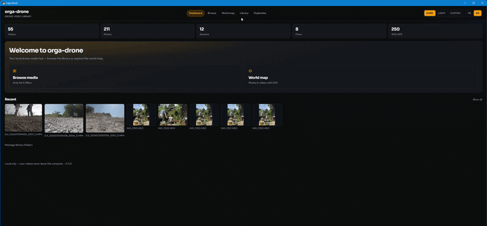

# Orga Drone

**A local-first drone media library with flight metadata, telemetry, map exploration, and a Studio memory-editor UI.**

Open source. Runs on your machine. No cloud account required. Built first for **DJI Avata 2**, usable on Windows (primary), macOS, and Linux via Python; Windows also ships as a downloadable desktop build.

**Vision:** help people organize, rediscover, create and share the memories behind their adventures — without becoming a professional video editor. See [`docs/PRODUCT_VISION.md`](docs/PRODUCT_VISION.md).

**Windows:** [Download latest exe (zip)](https://github.com/Magehawks/orga-drone/releases/latest/download/orga-drone-windows-x64.zip) · [All releases](https://github.com/Magehawks/orga-drone/releases)

## Scan Progress



## Screenshots

Home / overview (German UI):


Library folders:


Clip detail with map and telemetry:


Map marker follows video playback:


## The problem

People fly drones for experiences, not for managing files. Footage piles up across SD cards, backups, and vacation folders. Editing tools, generic photo managers, and basic flight logs each solve a slice of the problem. Orga Drone focuses on **organizing local media**, **reading drone-oriented metadata**, **grouping clips into flights**, **exploring where you flew**, and **preparing a light Studio story** — without uploading your library or requiring a pro editor.

## What Orga Drone currently provides

- Index one or more local folders into a single library (SQLite index; media files stay on disk)
- Browse videos and photos by date, size, duration, drone/camera label, GPS, flow, and session
- Index DJI media plus everyday vacation/hobby photos and videos (phones, cameras, action cams — no `DJI_` filename required)
- Extract GPS and related metadata from DJI `.SRT` telemetry, photo EXIF, and best-effort video container tags
- Group FAT32 **split clips** into a **flow**, and heuristically group a logical **flight session** (takeoff → landing)
- Explore locations on an embedded OpenStreetMap map (detail + world map) and follow the track while a clip plays
- Filter by date range; use **Ask the library** for short DE/EN phrases parsed by **deterministic rules** (not an LLM)
- Auto-tags on scan (year/month from recording time; offline place names from GPS when available)
- Manual favorites, stars, tags, and notes that survive a library rescan
- **Studio:** collect media, arrange order, estimate runtime; editable project
  title; simple video Cut (source start/end); Creator Studio UI with synced
  Story preview (music and export are UI stubs — no render pipeline yet)
- Rename files (and matching LRF/SRT siblings), merge split flow clips with ffmpeg (originals kept)
- Export a local spot GeoJSON download when GPS is available
- Detect **likely** duplicates across folders (heuristics only; never auto-deletes)
- UI in German and English; Dark / Light / Custom themes

It is **not** a video editor, mission planner, airspace tool, or cloud sync service. Studio music-in-export, MP4 rendering, and social share destinations are **planned** (see vision / roadmap), not Available today.

### Flows vs sessions

| | **Flow** | **Session** |
|---|----------|-------------|
| Meaning | One continuous recording split by the camera/filesystem (FAT32 ≈4 GB parts) | One logical flight from takeoff to landing |
| Detection | Near-limit file size + sequence/time gaps | Time gaps + optional SRT altitude/GPS (near ground ≈ landing) |
| UI | Badge “N parts”; filter for multi-clip flows | Badge “N clips”; filter for multi-clip sessions |

After each library scan, flows are rebuilt first, then sessions. Split parts of the same recording share one session.

## Current feature status

| Area | Status | Notes |
|------|--------|--------|
| Folder library + browse/list | Available | Full **rescan** per root (not incremental); live scan progress in Library UI |
| DJI naming, Avata 2 model map, SRT tracks | Available | Strongest path; SRT tracks are sampled for storage |
| Generic photos/videos + source filter | Available | Thinner than DJI; many phone videos have no GPS |
| iPhone Live Photo stills | Available | Same-stem HEIC/JPG + MOV → still shown, MOV sidecar hidden |
| Flows / sessions | Available | Heuristic; quality depends on timestamps and SRT |
| Maps + playback-synced telemetry overlay | Available | OSM tiles need network; overlay when a track exists |
| Ask the library + `POST /api/search` | Available | **Rule-based** DE/EN parser → structured filters |
| Auto-tags + offline reverse geocode | Available | `ORGA_DRONE_GEOCODE=offline` (default) or `off` |
| User meta (stars, favorite, tags, notes) | Available | Stored separately from auto-tags; survives rescan |
| Rename / flow merge | Available | Path confined under library roots; merge keeps originals |
| Duplicate detection | Available | Stem/size/date/duration heuristics — not content hash |
| Spot GeoJSON export | Available | Local download; coordinates rounded (~11 m) |
| Windows desktop EXE + pywebview | Available | macOS/Linux via Python today |
| Studio workspace | Available | Creator Studio UI with synced Story preview; persisted project title + order + estimated runtime + video Cut offsets; music/export stubs; one active project (not multi-project albums) |
| Studio MP4 export / music-in-export | Not available | Studio MVP target — see `docs/PRODUCT_VISION.md` |
| Projects / albums | Not available | Multi-project albums UI remains future work; Studio already has one persisted project with editable title |
| Plugin API | Not available | Possible future work |
| Semantic / LLM search | Not available | Not planned as product identity |
| Social share integrations | Not available | Later; local file / future MP4 first |
| CI-built multi-OS installers | Not available | Windows zip built/published manually today |

## Installation and first start

### Requirements

- Python **3.11+** (for the Python application)
- Dependencies from `requirements.txt` (includes `reverse-geocoder` for offline place auto-tags)
- Optional: network access for OSM map tiles (the library index itself works offline)

### Windows exe (end users)

**[Download latest Windows build](https://github.com/Magehawks/orga-drone/releases/latest/download/orga-drone-windows-x64.zip)** (`orga-drone-windows-x64.zip`)

1. Download the zip (or pick a version from [Releases](https://github.com/Magehawks/orga-drone/releases))
2. Unzip
3. **Double-click `orga-drone.exe`** — a desktop window opens; add a library folder when prompted

See [`packaging/README.md`](packaging/README.md) for build notes. Prebuilt binaries ship **only the application**, never your videos or database.

### Python application

```bash
git clone https://github.com/Magehawks/orga-drone.git
cd orga-drone
python -m venv .venv

# Windows
.venv\Scripts\activate

# macOS / Linux
source .venv/bin/activate

pip install -r requirements.txt
pip install -e .
```

Optional environment file:

```bash
cp .env.example .env
```

Do **not** put passwords or API keys in the repo. The app does not need them for local use.

Run:

```bash
python -m orga_drone
```

Or:

```bash
orga-drone
```

By default this opens a **native desktop window** (pywebview / Edge WebView2 on Windows). The FastAPI UI listens on `127.0.0.1` (port `8765`, or another free port if busy).

| Goal | How |
|------|-----|
| System browser instead of desktop window | Set `ORGA_DRONE_BROWSER=1` |
| pywebview not installed | Opens the system browser automatically |
| Open manually | Visit `http://127.0.0.1:8765/` |

Development extras:

```bash
pip install -e ".[dev]"
python -m orga_drone
```

### Add your media

1. Open **Library**
2. Paste a folder path (examples only — use your own path):
   - Windows: `D:\DroneMedia`
   - macOS/Linux: `/media/user/drone`
3. Click **Add folder** (scans immediately)
4. Use **Browse**, date filters, **Ask the library**, detail pages, and **Map**

### Browse, Ask the library, and search API

On **Browse**, use **From** / **To** (`date_from`, `date_to`) to narrow by recorded date.

**Ask the library** accepts short German or English phrases. The server parses them with **fixed rules** (kind, month/year, place keywords, favorites, and similar) and combines the result with explicit filters. It is **not** an LLM and does not perform semantic embedding search.

Examples: `videos from Malta`, `photos November 2025`, `favoriten 2024`.

Same filter logic over HTTP:

```bash
curl -s -X POST http://127.0.0.1:8765/api/search \
  -H "Content-Type: application/json" \
  -d '{"ask": "photos November 2025"}'
```

Body fields: `ask` (or `query`), plus optional `kind`, `date_from`, `date_to`, `q`, `place`, `tags`, `favorite`, `limit`. Explicit fields override fields inferred from `ask` when both are set.

### Tags and places

Each scan can compute **auto tags**: calendar year/month from `recorded_at`, plus city/region/country from GPS when available (offline reverse geocoding, cached in SQLite). Auto tags are read-only on the detail page. **User tags** remain fully manual.

- `ORGA_DRONE_GEOCODE=offline` — default; bundled reverse geocoder
- `ORGA_DRONE_GEOCODE=off` — skip place lookup (time tags still apply)

### Supported media (summary)

| Type | Formats | Date | GPS / map |
|------|---------|------|-----------|
| Photos | JPG/JPEG, PNG, WebP, HEIC/HEIF (`pillow-heif`), DNG | EXIF `DateTimeOriginal`, else mtime | EXIF GPS when present |
| Videos | MP4, MOV, M4V, MKV | Container / ffprobe when available, else mtime | Best-effort; many phone videos have no GPS |

**iPhone Live Photos:** same-stem still (`.HEIC`/`.JPG`) + companion `.MOV` → still indexed as a photo; companion MOV treated as a sidecar (not a standalone library video). A lone `.MOV` remains a normal video.

Non-DJI items typically get label **Camera** and `source_type` phone/camera/unknown. DJI paths (SRT, flows, sessions) stay as described above.

Typical Avata 2 sidecars:

```text
DJI_YYYYMMDDHHMMSS_NNNN_D.MP4
DJI_YYYYMMDDHHMMSS_NNNN_D.LRF   # proxy
DJI_YYYYMMDDHHMMSS_NNNN_D.SRT   # telemetry
DJI_YYYYMMDDHHMMSS_NNNN_D.JPG
```

### Themes, spot export, duplicates

- **Themes:** Dark / Light / Custom in the header; preference in cookie + `theme.json` under the app-data folder.
- **Spot export:** On a detail page with GPS, download `.orga-spot.json` (also `GET /media/{id}/export/spot.geojson`). Local only; coordinates rounded to 4 decimal places; optional simplified track LineString when SRT exists.
- **Duplicates:** After indexing folders that may overlap, open **Duplicates** and scan. Matching uses DJI stem and/or filename + exact size with tight date/duration tolerances. Detection and navigation only — **no automatic deletion**.

### Where app data lives

SQLite index and thumbs live in the OS app-data folder, for example:

- Windows: `%APPDATA%\orga-drone\`
- macOS: `~/Library/Application Support/orga-drone/`
- Linux: `~/.local/share/orga-drone/`

Override with `ORGA_DRONE_DATA_DIR` in `.env`.

Leaflet + MarkerCluster are vendored under `/static/vendor/` (no CDN required for those assets). OSM **tiles** still need network. Studio transport/editing icons use **Lucide** SVGs vendored under `/static/vendor/lucide/` (ISC; see that folder’s README).

## Technology and architecture

| Layer | Choice |
|-------|--------|
| UI | Local FastAPI app, Jinja templates, static JS/CSS |
| Desktop shell | pywebview (Edge WebView2 on Windows); browser fallback |
| Index | SQLite in the app-data directory |
| Media | Streamed from configured library folders (not embedded in the binary) |
| Thumbnails / merge | Pillow / pillow-heif; `imageio-ffmpeg` or system `ffmpeg` |
| Maps | Leaflet (vendored) + OpenStreetMap tiles |
| Packaging | PyInstaller onefolder Windows zip (see `packaging/`) |

High-level flow: add folder → full scan/parse → SQLite index → browse/map/detail → optional rename, merge, export. Domain code lives under `src/orga_drone/` (`parse`, `scan`, `group`, `search`, `geocode`, `dupes`, `export`, `ops`, …).

Deeper project docs: [`docs/PRODUCT_VISION.md`](docs/PRODUCT_VISION.md), [`docs/ROADMAP.md`](docs/ROADMAP.md), [`docs/ARCHITECTURE.md`](docs/ARCHITECTURE.md), and agent context in [`AGENTS.md`](AGENTS.md).

## Roadmap

**Vision:** organize, rediscover, create and share adventure memories — without becoming a pro NLE. Details: [`docs/PRODUCT_VISION.md`](docs/PRODUCT_VISION.md).

**Possible next steps** (not available now):

- Studio simple MP4 export + optional one music track (Studio MVP target)
- Open / reveal exported local files on desktop
- Projects or albums for organizing media sets
- Incremental or cheaper library rescans
- Broader multi-brand parsers beyond the current DJI-first depth
- Optional opt-in community sharing of flight spots (builds on local GeoJSON)
- Online geocoding providers (place auto-tags are offline today)
- Plugin / extension hooks for parsers and exports
- CI-built installers for Windows / macOS / Linux
- Optional intelligent features only when they solve a concrete memory/library problem

Full prioritization language: [`docs/ROADMAP.md`](docs/ROADMAP.md).

## Contributing

Bug reports, features, docs, and PRs are welcome — see [CONTRIBUTING.md](CONTRIBUTING.md). Please follow the [Code of Conduct](CODE_OF_CONDUCT.md). To report a security issue privately, see [SECURITY.md](SECURITY.md).

```bash
pip install -e ".[dev]"
ruff check .
mypy src
pytest
```

## Project status and limitations

Orga Drone is a **usable open-source application** with a Windows release channel and an active Python codebase. It is still early as a multi-brand “platform”: expect DJI-oriented strengths, heuristic flight grouping, and full folder rescans.

Known limitations:

- Full rescan per library root (user metadata is preserved; indexed media rows are rebuilt)
- Session and duplicate results are best-effort heuristics
- No multi-project albums UI (Studio uses one persisted project with editable
  title and non-destructive clips), no plugin API, no content-hash duplicate
  detection
- Ask the library is rule-based phrase parsing, not generative AI
- CI covers Ruff, MyPy, and unit tests on pull requests; release/installer automation is not included
- Telemetry **burn-in** into exported video is not included

If video browsing feels heavy under Windows Defender, exclude the unzipped `orga-drone` folder (see [`packaging/README.md`](packaging/README.md)).

## License

MIT — see [LICENSE](LICENSE).
